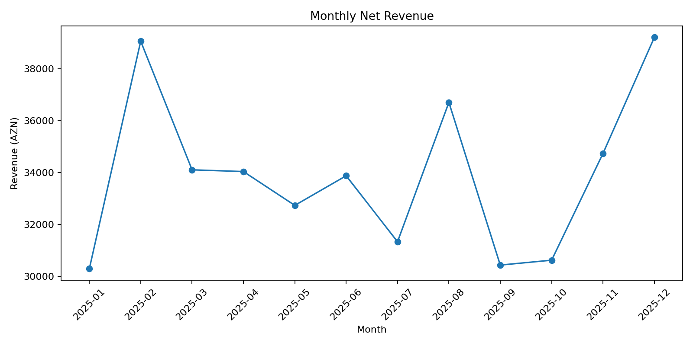
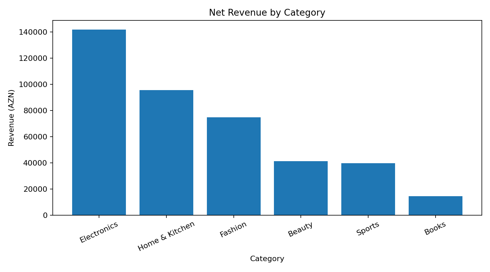
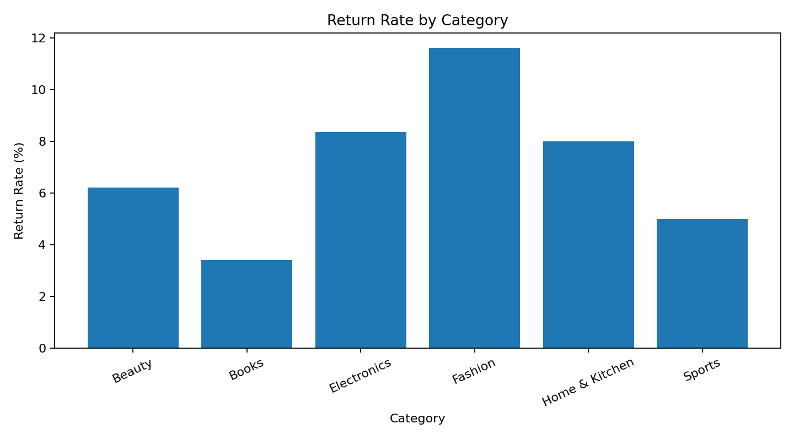

# E-commerce Sales & Customer Behavior Analysis

**Python · pandas · NumPy · Matplotlib · SQLite · Jupyter**

A business analysis of **3,000 synthetic orders across Azerbaijan in 2025**, connecting sales performance, profitability, returns, and delivery experience.

**Start here:** [Analysis notebook](ecommerce_sales_analysis.ipynb) · [SQL queries](analysis_queries.sql) · [Dataset](ecommerce_sales_data.csv) · [Data dictionary](docs/data-dictionary.md)

> Portfolio case study using simulated data. These results illustrate an analytical workflow, not the performance of a real company.

## Results at a glance

| Metric | Result | Definition |
| --- | ---: | --- |
| Orders | 3,000 | One row per unique Order_ID |
| Net revenue | 407,175.17 AZN | Sum of Net_Revenue_AZN, including zero-revenue returns |
| Profit | 133,513.24 AZN | Sum of the supplied Profit_AZN field |
| Average order value | 135.73 AZN | Net revenue / all orders, including returns |
| Return rate | 7.67% | 230 returned orders / 3,000 orders |
| Average rating | 4.27 / 5 | Unweighted mean of order ratings |

## Business questions

- How does monthly net revenue change?
- Which product categories and cities contribute the most revenue and profit?
- Where are return rates highest?
- How do customer ratings vary with delivery duration?
- Which customers contribute the most observed revenue?

## Findings and decisions to investigate

| Evidence in this dataset | Suggested next step |
| --- | --- |
| Electronics leads revenue at **141,701.43 AZN**, but Home & Kitchen leads profit at **31,171.77 AZN**. | Compare margin and demand before allocating inventory or marketing spend. Revenue alone is insufficient. |
| Baku contributes **197,618.07 AZN**, or **48.53%** of net revenue. | Investigate regional demand and delivery capacity; this concentration does not prove that spending more in Baku will be profitable. |
| Fashion has **76 returns out of 654 orders (11.62%)**, above the overall 7.67%. | Collect return reasons and examine product descriptions, fit, and quality. The dataset does not contain return reasons. |
| Average rating falls from **4.54** for one-day delivery to **3.89** for six-day delivery. | Investigate delays and category/customer differences before drawing causal conclusions. The eight-day group contains only one order. |
| Card payments account for **1,712 orders (57.07%)**. | Monitor payment experience; payment preference alone does not establish conversion impact. |

## Visual overview

### Monthly revenue



### Category performance



### Return risk



More visuals: [Revenue by city](03_revenue_by_city.png) · [Rating distribution](05_rating_distribution.png). The notebook also includes a delivery-time versus rating chart.

## Analysis workflow

1. Load the CSV and parse Order_Date.
2. Inspect dimensions, missing values, and duplicate rows.
3. Calculate order-level KPIs with explicit denominators.
4. Compare monthly, category, city, return, delivery, and customer patterns.
5. Translate descriptive findings into questions for further investigation.

The CSV contains 19 columns, no missing values, and 3,000 unique order IDs. Seven companion queries use **SQLite syntax**, including STRFTIME for monthly grouping. They are not PostgreSQL queries without adaptation.

## Run locally

Download this repository using **Code → Download ZIP**, extract it, and open a terminal in the extracted folder. With Python installed:

```sh
python -m venv .venv
# Windows PowerShell:
.venv\Scripts\Activate.ps1
# macOS / Linux:
# source .venv/bin/activate
python -m pip install -r requirements.txt
python -m jupyter lab
```

Open `ecommerce_sales_analysis.ipynb` and run the cells in order. Keep the CSV beside the notebook. Dependencies are declared but not a locked environment.

To load the same data into an in-memory SQLite database and execute all seven queries:

```sh
python scripts/run_sql.py
```

## Repository guide

| Path | Purpose |
| --- | --- |
| `ecommerce_sales_analysis.ipynb` | Python analysis with saved tables and charts |
| `ecommerce_sales_data.csv` | Synthetic order-level input |
| `analysis_queries.sql` | Seven SQLite analysis queries |
| `01_*.png` through `05_*.png` | Existing exported charts at repository root |
| `project_insights.txt` | Original concise project summary |
| `docs/data-dictionary.md` | Fields, metric definitions, and limitations |
| `scripts/run_sql.py` | Reproducible CSV-to-SQLite analysis |
| `requirements.txt` | Python dependencies |

## Scope and limitations

- Synthetic patterns cannot establish real-market demand, customer behavior, or business impact.
- Revenue and cost fields are supplied by the dataset. The original generator, seed, and full cost assumptions are not included.
- Customer rankings describe observed 2025 revenue, not customer lifetime value.
- Delivery and rating comparisons show association, not causation. No controlled experiment or predictive model is included.
- A full-year series alone does not establish recurring seasonality.
- The repository does not currently specify a license. Check reuse rights before redistribution.

## Next improvements

Add a documented data generator, customer cohort analysis, and a dashboard with filters and a clear metric glossary. Keep these as future work until the code and outputs are available.
